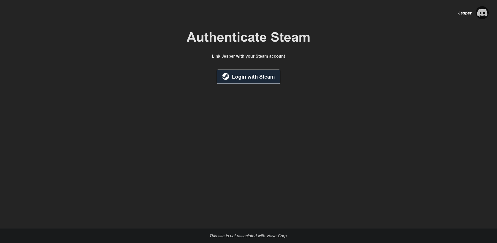

# CS:GO Hub backend

## About
This is the backend for the CS:GO Hub bot, it works by collecting the Discord users Id upon request to link the account, the bot will respond with a custom link for the user where they will be able to link their steam by account by using Steam's OpenID system to gather their Steam ID and then converting it to the corresponding CS:GO friend code.
It functions with the [CS:GO Hub Discord bot](https://github.com/jesperbakhandskemager/csgo-hub-discord).

A user can request to link their account with the bot by issuing the `/link-steam` command in any server in which the bot is present or by executing the command in a direct message to the bot.
The bot the bot will send the Discord Id of the user along to the backend which will respond with a custom link containing a token to identify the user.

Once an account is linked, anyone in the same voice channel as them can issue the `/show-team` command and be presented with their CS:GO friend code along with any other accounts linked in the same VC assuning they ran the command in the same server as the voice call is in.

## Database
You need the following tables in MySQL

```{sql}
CREATE TABLE
  `tokens` (
    `id` int(10) unsigned NOT NULL AUTO_INCREMENT,
    `discord_id` varchar(21) COLLATE utf8mb4_unicode_ci NOT NULL,
    `token` varchar(8) COLLATE utf8mb4_unicode_ci NOT NULL,
    PRIMARY KEY (`id`)
  ) ENGINE = InnoDB AUTO_INCREMENT = 17 DEFAULT CHARSET = utf8mb4 COLLATE = utf8mb4_unicode_ci
CREATE TABLE
  `users` (
    `id` int(10) unsigned NOT NULL AUTO_INCREMENT,
    `created_at` timestamp NOT NULL DEFAULT current_timestamp(),
    `discord_id` varchar(21) COLLATE utf8mb4_unicode_ci NOT NULL,
    `friend_code` varchar(10) COLLATE utf8mb4_unicode_ci DEFAULT 'NULL',
    PRIMARY KEY (`id`)
  ) ENGINE = InnoDB AUTO_INCREMENT = 6 DEFAULT CHARSET = utf8mb4 COLLATE = utf8mb4_unicode_ci
```

## Screenshots

